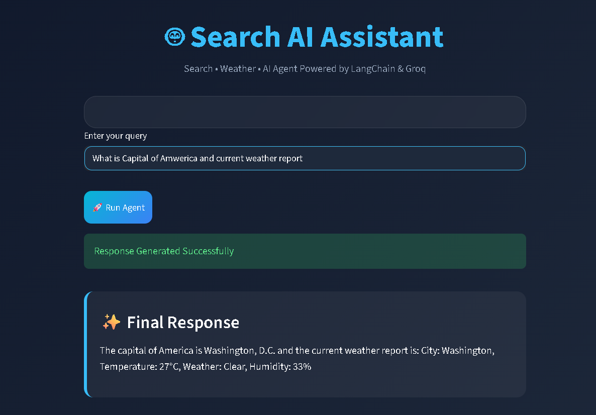

# 🚀 Search AI Assistant

An AI-powered Search & Weather Assistant built using **LangChain**, **Groq LLM**, and **Streamlit**. The application can answer general knowledge questions, perform intelligent searches, and provide real-time weather information through a clean and modern interface.

## 🌐 Live Demo

🔗 https://search-ai-assistant.onrender.com

---

## 📸 Project Preview



---

## ✨ Features

* AI-Powered Question Answering
* Real-Time Weather Information
* Intelligent Search Agent
* LangChain Agent Workflow
* Groq LLM Integration
* Fast Response Generation
* Interactive Streamlit Interface
* Modern Responsive UI

---

## 🛠️ Tech Stack

### Frontend

* Streamlit

### Backend

* Python
* LangChain

### AI & LLM

* Groq API
* Llama Models

### Integrations

* WeatherStack API
* Search Tools

---

## 🎯 Example Queries

```text
What is the capital of India?

What is the weather in Delhi?

Who is the CEO of Microsoft?

Tell me about Artificial Intelligence.

Weather report of New York today.
```

---

## ⚙️ How It Works

1. User enters a query.
2. LangChain Agent analyzes the request.
3. The agent selects the appropriate tool.
4. Groq LLM generates the final response.
5. Results are displayed in the Streamlit interface.

---

## 🚀 Deployment

Deployed on Render and accessible through the live application link above.

---

## 📈 Future Enhancements

* Voice Assistant Support
* Multi-Agent Architecture
* Chat Memory
* News Search Integration
* PDF & Document Q&A
* RAG Pipeline Integration
* Search History

---

### 👨‍💻**Author: Ankit Gupta**
AI/ML Engineer | Python Developer | Generative AI Enthusiast

---

⭐ If you like this project, don't forget to star the repository.
